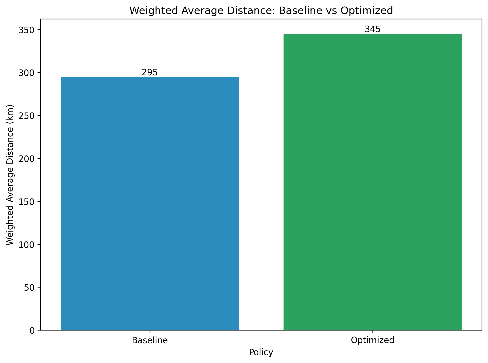
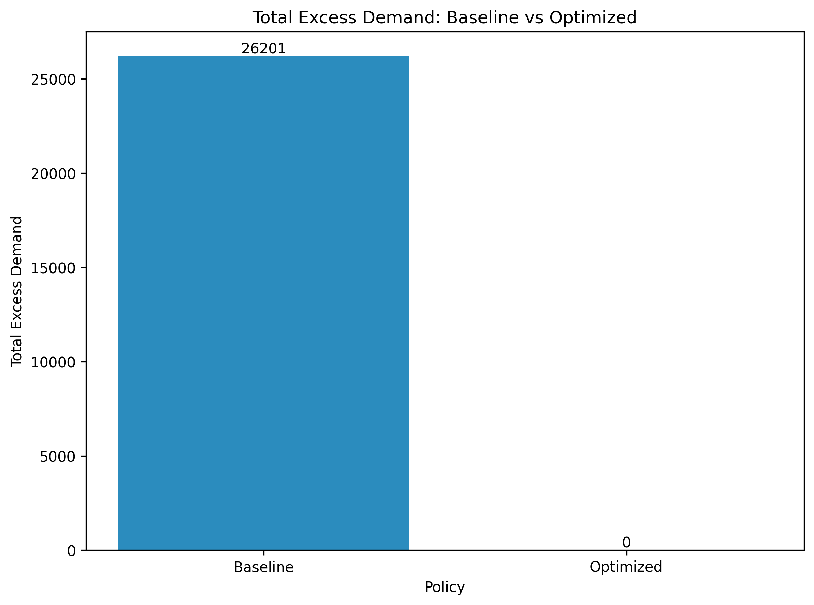
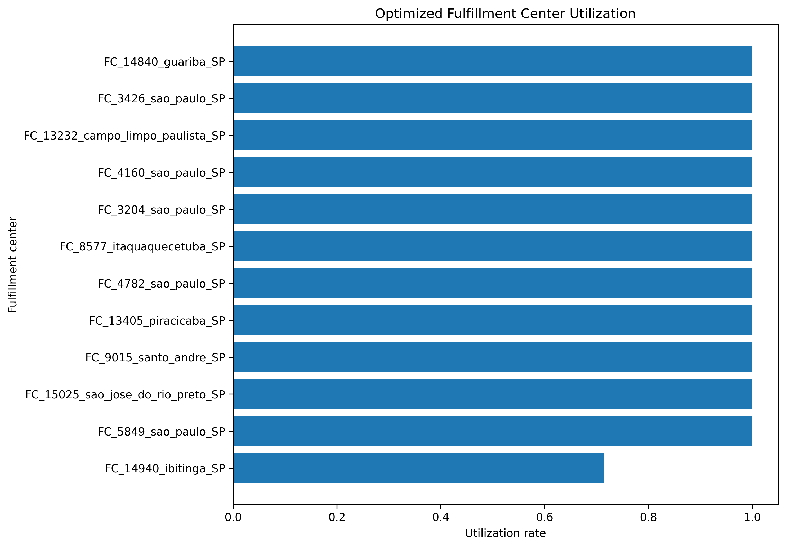
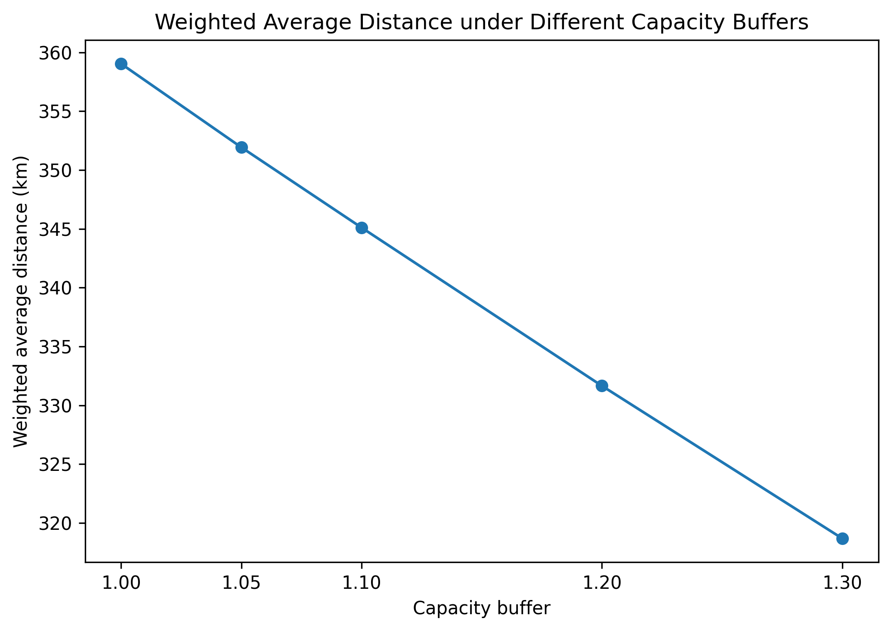

<h1 class="portfolio-title">E-Commerce Fulfillment Optimization with Capacity Constraints</h1>

Portfolio 2: Logistics and Fulfillment Optimization | Elsie Chu

  <a href="#1-introduction">Introduction</a>
  <a href="#2-research-question">Research Question</a>
  <a href="#3-data">Data</a>
  <a href="#4-methods">Methods</a>
  <a href="#5-results">Results</a>
  <a href="#6-discussion">Discussion</a>
  <a href="#7-limitations">Limitations</a>
  <a href="#8-conclusion">Conclusion</a>
  <a href="#tools">Tools</a>

This page summarizes an applied logistics optimization portfolio using public e-commerce data. The project compares a nearest-center baseline policy with capacity-constrained optimization models.

## 1. Introduction

In real e-commerce distribution situations, it is important to consider not only route cost and distance, but also whether each fulfillment center or warehouse location has enough capacity to handle the assigned demand. A simple nearest-center rule may look efficient because it sends each customer zone to the closest fulfillment center, but it can cause unexpected capacity issues when demand is concentrated in big cities or nearby warehouses have limited capacity.

This project uses a public dataset, the [**Brazilian E-Commerce Public Dataset by Olist**](https://www.kaggle.com/datasets/olistbr/brazilian-ecommerce), and constructs metrics such as warehouse capacity, `cost_per_km`, transportation cost, candidate warehouse locations, and demand zones to conduct a logistics and fulfillment allocation analysis. This project uses a baseline nearest-center policy, an initial binary assignment model, and a final transportation allocation model to support more feasible allocation decisions under demand and warehouse capacity constraints.

## 2. Research Question

**How can optimization reduce logistics cost while satisfying customer demand and fulfillment center capacity constraints?**

To be specific, this project compares a baseline policy, which is the nearest-center policy, with optimization models. I improved the initial optimization model, which is the binary assignment model, and defined the final optimization model, which is the transportation allocation model. The final model can satisfy both demand fulfillment constraints and capacity constraints. It also allows aggregated customer-zone demand to be split across multiple fulfillment centers, so that the model can finally find feasible optimized results.

## 3. Data

This project uses the **Brazilian E-Commerce Public Dataset by Olist** on Kaggle. This dataset contains essential variables from five tables: **orders, order items, customers, sellers, and geolocation**. These variables include order-related variables, customer location variables, seller location variables, and geographic coordinate variables.

I also constructed customer demand zone variables, candidate fulfillment center variables, route distance and cost variables, and model parameters for logistics optimization modeling. These constructed variables should not be interpreted as Olist's real warehouse network.

### Original Variable Categories

- Order-related variables
- Customer location variables
- Seller location variables
- Geographic coordinate variables

### Constructed Variable Categories

- Customer demand zone variables
- Candidate fulfillment center variables
- Route distance and cost variables
- Model parameters

## 4. Methods

### 4.1 Data Preparation

This project used five tables from the Olist dataset: orders, order items, customers, sellers, and geolocation. First, I created a base logistics table with delivered order items, customer information, and seller information. I then matched customer and seller zip-code prefixes with the geolocation table to obtain approximate latitude and longitude coordinates, and calculated the distance between each customer and the corresponding seller to create the `order_logistics_with_distance` table.

For the demand side, I created `customer_zone` from customer city and customer state. Demand was measured as the number of delivered orders in each customer zone. I then selected the top 30 customer zones with the highest order demand for further analysis.

For the supply side, I grouped seller locations by `seller_zip_code_prefix` and related seller location variables. For each seller zip-code location, I calculated `historical_order_volume` as the number of delivered order items associated with that location. I then selected the top 12 seller zip-code locations by `historical_order_volume` as candidate fulfillment centers.

Lastly, I constructed the `distance_cost_matrix` table with each selected customer demand zone, which was paired with every candidate fulfillment center. Each row represents one possible service route and includes customer demand, estimated fulfillment capacity, route distance, unit transportation cost, and calculated potential transportation cost.

### 4.2 Baseline Policy

I established the nearest-center baseline as a simple comparison method. This policy assigned all customer demand to the fulfillment center with the shortest distance for each customer demand zone. I then calculated total transportation cost, weighted average distance, assigned demand for each fulfillment center, utilization rate, and capacity violation.

This baseline policy shows the situation when logistics decisions only focus on short-distance assignment without considering fulfillment capacity during the allocation process.

### 4.3 Initial Binary Assignment Model

After the baseline policy, I formulated an initial binary assignment model. In this model, each customer demand zone had to be assigned to one single candidate fulfillment center. The objective of this initial optimization model was to minimize total distance-based transportation cost, while each fulfillment center could not receive demand greater than its estimated capacity.

However, this model result was infeasible because the demand of some large customer demand zones exceeded the capacity of any single candidate fulfillment center. Since the binary assignment model did not allow one customer zone to split demand across multiple fulfillment centers, it could not find a feasible allocation plan under the capacity constraints.

### 4.4 Final Transportation Allocation Model

To solve the infeasibility of the binary assignment model, I developed a transportation allocation model. Instead of forcing each customer demand zone to be assigned to only one fulfillment center, this model allowed demand from one customer zone to be split across multiple candidate fulfillment centers.

The decision variable represented the amount of demand allocated from each customer demand zone to each candidate fulfillment center. This final optimization model not only minimized total transportation cost, but also satisfied capacity constraints and customer demand constraints. This final model was used as the main optimization model in this project.

### 4.5 Model Implementation and Solver

I implemented the final transportation allocation model in Python using PuLP. PuLP was used to define the allocation decision variables, objective function, and demand and capacity constraints. The final optimization model, which is the transportation allocation model, used `distance_cost_matrix` as its main input table, where each row represents one possible route between a customer zone and a candidate fulfillment center.

After the optimization model was solved, I checked the solver status to confirm whether a feasible optimal solution was successfully found. The solver output provided `allocated_demand`, which represents the amount of demand assigned from a customer demand zone to a candidate fulfillment center in the final transportation allocation model. Based on allocation results, I then calculated route costs, total transportation costs, weighted average distance, fulfillment center utilization rates, and capacity violation metrics.

### 4.6 Sensitivity Analysis

I conducted sensitivity analysis to test how different capacity assumptions affect the optimization results. I recalculated fulfillment center capacity when the `capacity_buffer` was changed to 1.00, 1.05, 1.10, 1.20, and 1.30. For each capacity buffer scenario, I re-solved the final transportation allocation model and compared total transportation cost, weighted average distance, and fulfillment center utilization.

Sensitivity analysis evaluated these logistics allocation results from the final transportation allocation model by using solver status, total transportation cost, weighted average distance, and fulfillment center utilization. These metrics show whether the model remains feasible and whether the cost-distance trade-off changes reasonably under different capacity assumptions.

## 5. Results

### 5.1 Baseline vs Optimized Policy Comparison

The baseline policy and the optimized allocation model showed a clear trade-off between short-distance allocation and capacity feasibility.

| Metric | Baseline | Optimized |
|---|---:|---:|
| Total transportation cost | 15,115,364.07 | 17,701,059.42 |
| Weighted average distance | 294.70 km | 345.11 km |
| Capacity violated centers | 4 | 0 |
| Total excess demand | 26,201 | 0 |
| Maximum utilization rate | 6.08 | 1.00 |

The baseline nearest-center policy had a lower total transportation cost and a shorter weighted average distance. However, it created 4 capacity-violated centers and 26,201 units of excess demand. The optimized model increased total transportation cost by **17.11%**, but it solved the problem of all capacity violations.

This comparison result shows that the closest fulfillment center is not always the best decision in operations planning. If capacity is ignored, the logistics optimization policy may improve efficiency in terms of distance metrics, but it can overload some fulfillment centers.

The following figures compare the baseline and optimized models in terms of total transportation cost, weighted average distance, and total excess demand.

**Figure 1. Total transportation cost comparison**

**Figure 2. Weighted average distance comparison**

**Figure 3. Total excess demand comparison**

### 5.2 Optimized Fulfillment Center Utilization

After optimization, no fulfillment center exceeded its estimated capacity. The maximum utilization rate was **1.00**, which means the busiest fulfillment center was fully used but did not exceed its estimated capacity.

This is the main difference between the baseline policy and the optimized model. The baseline policy only assigned customer demand to the nearest fulfillment center, while the optimized model considered both distance-based cost and whether allocated demand exceeded fulfillment center capacity.

**Figure 4. Optimized fulfillment center utilization**

### 5.3 Capacity Sensitivity Analysis

The sensitivity analysis tested how the final optimization model results changed when the `capacity_buffer` was changed from **1.00 to 1.30**. For each capacity buffer, fulfillment center capacity was recalculated and the final transportation allocation model was solved again.

| Capacity Buffer | Total Transportation Cost | Weighted Avg Distance |
|---:|---:|---:|
| 1.00 | 18,415,335.87 | 359.04 km |
| 1.30 | 16,345,438.15 | 318.68 km |

As the capacity buffer increased, total transportation cost and weighted average distance both decreased in the final transportation allocation model. From capacity buffer **1.00** to **1.30**, total transportation cost decreased by **2,069,897.72**, and weighted average distance decreased by **40.36 km**.

This result is reasonable because more available fulfillment capacity gives the model more routing flexibility. With more warehouse capacity, the model can assign more customer demand to closer fulfillment centers instead of sending demand to farther fulfillment centers only because of capacity limits.

**Figure 5. Transportation cost under different capacity buffers**

**Figure 6. Weighted average distance under different capacity buffers**

**Figure 7. Fulfillment center utilization under different capacity buffers**

## 6. Discussion

The results show that the nearest-center baseline policy is not the best logistics optimization decision. In the baseline policy, each customer demand zone was assigned to the closest candidate fulfillment center. Although this way reduced total transportation distance and total transportation cost, it also caused capacity violation issues, because some fulfillment centers were allocated much more customer demand than their estimated capacity.

Capacity constraints are important because they make the allocation plan more realistic. Without capacity constraints, the model may assign too much demand to nearby fulfillment centers and create overload problems. By adding capacity constraints, the optimized model can produce a feasible allocation plan that balances distance-based cost and fulfillment capacity.

The final transportation allocation model solved this problem by considering both total transportation cost and fulfillment center capacity. After improving the baseline policy with the final optimization model, all customer demand was served and no fulfillment center exceeded its capacity. However, this plan also increased total transportation cost and weighted average distance. This is reasonable because some customer demand had to be assigned to farther fulfillment centers in order to avoid overloading nearby fulfillment centers.

This trade-off is the main finding of this project. A logistics policy that looks efficient by distance may not be feasible when operational constraints are included. In real distribution planning, the closest fulfillment location may not be the best choice if that center does not have enough capacity.

The sensitivity analysis also shows that different capacity buffer values can affect the logistics optimization result. When the capacity buffer increased, the model had more flexibility to assign customer demand to closer fulfillment centers, so both total transportation cost and weighted average distance decreased. This suggests that fulfillment capacity is an essential factor in this logistics optimization problem.

Overall, this project shows how order, seller, customer, and location data can be transformed into a logistics optimization problem. Although the model is simplified, it still demonstrates an important operations analytics idea: logistics distribution decisions should balance cost, distance, and fulfillment capacity feasibility instead of relying only on the nearest-center rule, which is the baseline policy.

## 7. Limitations

Firstly, the Olist dataset does not provide real warehouse locations or real warehouse capacity. I used high-volume seller zip-code locations as candidate fulfillment centers, and estimated capacity based on historical order item volume and capacity buffer assumptions. These constructed fulfillment centers are useful for modeling, but they should not be interpreted as real Olist warehouses.

Secondly, transportation cost was simplified as a distance-based cost. The model used route distance, an assumed `cost_per_km`, and allocated customer demand to calculate total transportation cost. In reality, logistics cost can also depend on delivery time, road network, fuel cost, carrier pricing, package size, service level, and regional delivery conditions. These factors were not included in this project.

Thirdly, the demand side and supply side were simplified to keep the optimization problem clear and manageable. I selected the top 30 customer demand zones and the top 12 seller zip-code locations for the main analysis. This helps focus on major demand and fulfillment flows, but it does not represent the full Olist logistics workflow.

Lastly, demand in this project was based on historical delivered orders. The model did not forecast future demand or consider seasonal demand changes. In further analysis, it would be useful to add demand forecasting to estimate future customer demand more realistically. It would also be interesting to include more realistic transportation cost factors, such as delivery time, fuel cost, carrier pricing, package weight, package size, and regional delivery conditions.

## 8. Conclusion

This project built a logistics optimization workflow using the Olist e-commerce dataset. I first prepared the order, customer, seller, and geolocation data, then constructed customer demand zones, candidate fulfillment centers, and a `distance_cost_matrix` for further logistics allocation analysis.

The results show that the nearest-center baseline policy had lower total transportation cost and shorter weighted average distance, but it caused capacity violations. This means that assigning customer demand only based on the shortest distance is not feasible when fulfillment center capacity constraint is considered.

The final transportation allocation model provided a more feasible solution. Although this optimized model increased total transportation cost and weighted average distance, it served all customer demand without exceeding fulfillment center capacity. The sensitivity analysis also shows that different capacity buffer assumptions can affect the final allocation result.

Overall, this project shows that logistics optimization decisions should not only focus on distance or transportation cost. Capacity constraints are also essential because they determine whether an allocation plan can actually work normally in operations. This project helped me practice how to turn raw e-commerce data into a structured operations analytics problem and use optimization to support logistics decision strategies.

## Tools

- Python: data preparation and modeling
- pandas / NumPy: data cleaning and aggregation
- PuLP: optimization modeling
- Matplotlib: result visualization
- Jupyter Notebook: project workflow
- GitHub Pages: portfolio presentation