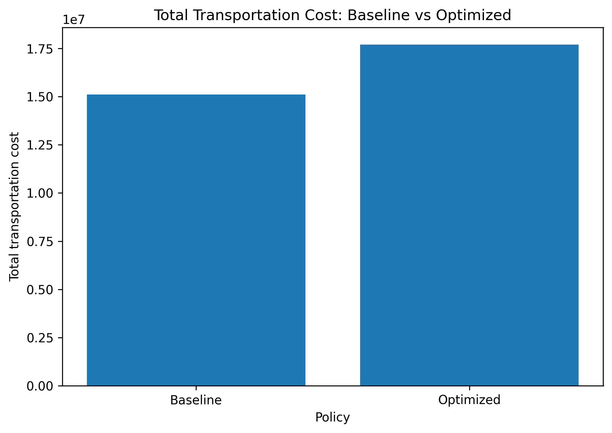
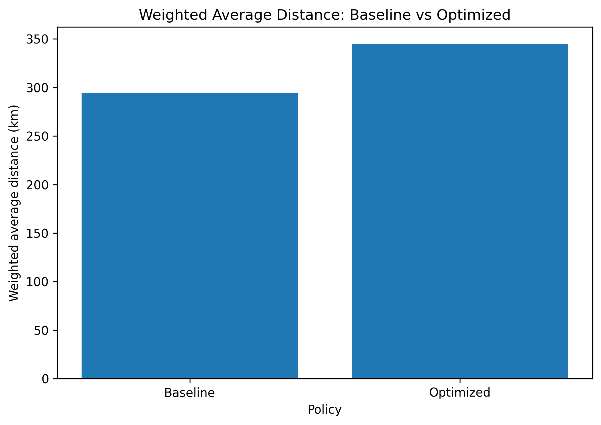
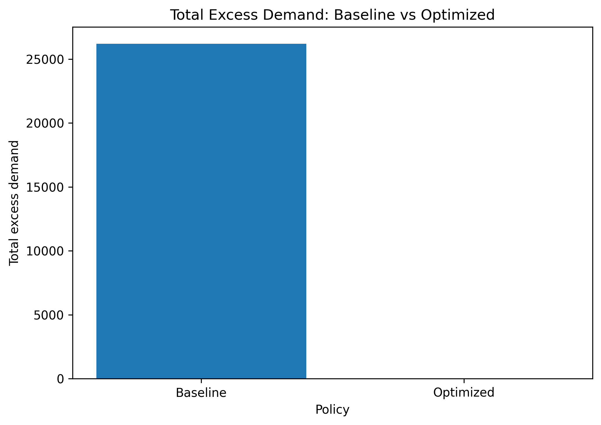
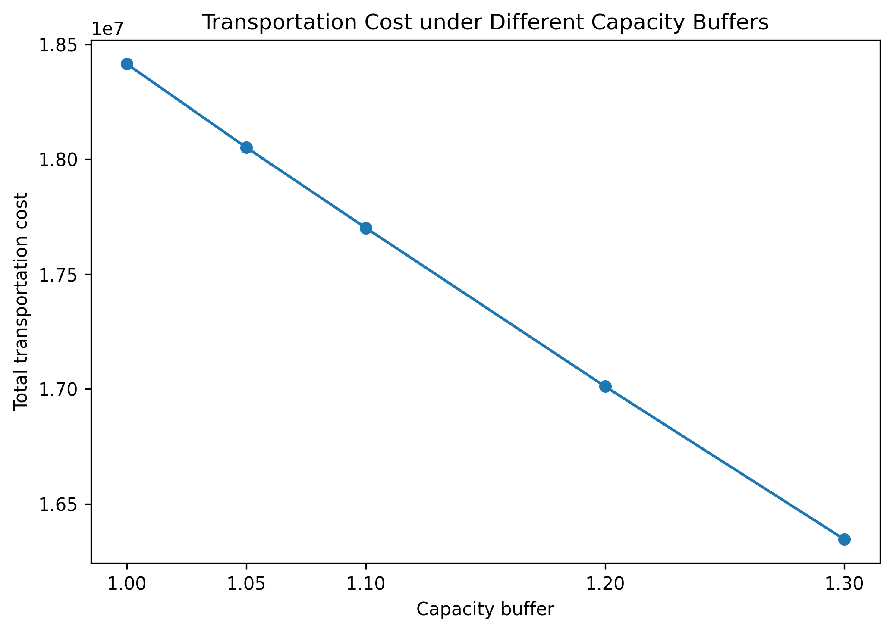
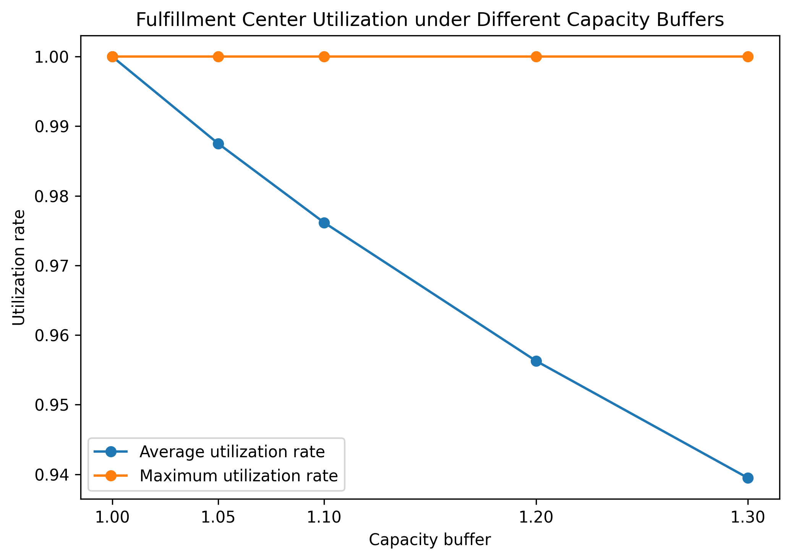

# Logistics Optimization for Cost-Efficient E-Commerce Distribution Decisions

## Abstract

This project develops a logistics optimization framework for e-commerce distribution decisions using the Brazilian E-Commerce Public Dataset by Olist. The project transforms raw order, seller, customer, and geolocation data into an operations analytics problem: how to allocate customer demand zones to fulfillment centers while balancing transportation cost and capacity constraints.

A nearest-center baseline policy is compared with a capacity-constrained transportation allocation model. The baseline policy achieves lower transportation cost and shorter average distance, but it overloads several fulfillment centers. The optimized model eliminates all capacity violations and excess demand by allowing aggregated customer-zone demand to be allocated across multiple candidate fulfillment centers.

The optimized policy increases total transportation cost by 17.11% and weighted average distance by 17.11% compared with the baseline. However, it reduces capacity violated centers from 4 to 0, and total excess demand from 26,201 to 0.

---

## 1. Project Overview

E-commerce platforms face a common logistics decision problem: customer demand is geographically distributed, while fulfillment resources are limited and unevenly located. A simple nearest-center rule may reduce travel distance, but it can overload nearby fulfillment centers and produce an infeasible operational plan.

This project studies the following research question:

**How can optimization models support cost-efficient e-commerce distribution decisions by allocating customer demand zones to fulfillment centers under distance and capacity constraints?**

The project is designed as an applied operations and supply chain analytics portfolio. It demonstrates how real-world transaction and geolocation data can be converted into a decision-support model for logistics planning.

---

## 2. Data and Feature Construction

The project uses the Brazilian E-Commerce Public Dataset by Olist. The analysis uses order, order item, customer, seller, and geolocation data.

The main processing steps are:

1. Filter delivered orders.
2. Merge order, customer, seller, and freight information.
3. Clean geolocation data at the zip-code-prefix level.
4. Match customer and seller locations with latitude and longitude.
5. Calculate seller-customer distance using the haversine formula.
6. Aggregate customer demand zones at the city-state level.
7. Construct candidate fulfillment centers from high-volume seller zip-code locations.
8. Build a customer-zone and fulfillment-center distance-cost matrix.

The final optimization instance contains:

| Item | Value |
|---|---:|
| Customer demand zones | 30 |
| Candidate fulfillment centers | 12 |
| Selected customer demand | 51,291 |
| Main-scenario total capacity | 56,421 |
| Main capacity buffer | 1.10 |

Candidate fulfillment centers are constructed from seller locations. They should be interpreted as potential fulfillment nodes, not as verified real Olist warehouse locations.

---

## 3. Methodology

### 3.1 Baseline Policy: Nearest-Center Assignment

The baseline policy assigns each customer demand zone to the geographically nearest candidate fulfillment center. This rule is easy to understand and produces low-distance assignments, but it does not consider capacity limits.

The baseline policy represents a simple operational heuristic:

**Assign each demand zone to the nearest center, regardless of capacity.**

### 3.2 Optimization Policy: Capacity-Constrained Allocation

The optimization model is a transportation allocation model. It allows demand from one customer zone to be split across multiple fulfillment centers because each customer zone represents aggregated order volume rather than a single individual customer.

The decision variable is:

**y[j, i] = amount of demand from customer zone j allocated to fulfillment center i**

The objective is to minimize total distance-weighted transportation cost.

The model has two main constraints:

1. Each customer demand zone's total demand must be fully served.
2. Each fulfillment center's assigned demand cannot exceed its capacity.

This model is more realistic than the nearest-center baseline because it produces a feasible allocation under capacity limits.

---

## 4. Main Results

| Metric | Baseline Nearest-Center Policy | Optimized Capacity-Constrained Allocation |
|---|---:|---:|
| Total demand | 51,291 | 51,291 |
| Total capacity | 56,421 | 56,421 |
| Total transportation cost | 15,115,364.07 | 17,701,059.42 |
| Weighted average distance | 294.70 km | 345.11 km |
| Capacity violated centers | 4 | 0 |
| Total excess demand | 26,201 | 0 |
| Maximum utilization rate | 6.08 | 1.00 |

The baseline policy has lower transportation cost and shorter weighted average distance. However, it violates capacity constraints at 4 fulfillment centers and creates 26,201 units of excess demand.

The optimized policy eliminates all capacity violations and reduces total excess demand to zero. The trade-off is that total transportation cost increases by 17.11% and weighted average distance increases by 17.11%.

This result reflects a key operations management insight: the lowest-distance solution is not always feasible once capacity constraints are considered.

---

## 5. Figures

### Figure 1. Total Transportation Cost

### Figure 2. Weighted Average Distance

### Figure 3. Total Excess Demand

### Figure 4. Optimized Fulfillment Center Utilization

---

## 6. Capacity Sensitivity Analysis

The main model uses a capacity buffer of 1.10. To test how capacity assumptions affect logistics performance, this project evaluates capacity buffers from 1.00 to 1.30.

| Capacity Buffer | Total Transportation Cost | Weighted Avg Distance | Avg Utilization Rate |
|---:|---:|---:|---:|
| 1.00 | 18,415,335.87 | 359.04 km | 1.000 |
| 1.30 | 16,345,438.15 | 318.68 km | 0.939 |

When the capacity buffer increases from 1.00 to 1.30, total transportation cost decreases by 2,069,897.72, and weighted average distance decreases by 40.36 km.

This suggests that additional fulfillment capacity improves routing flexibility and allows the model to allocate more demand to closer fulfillment centers.

### Figure 5. Transportation Cost under Different Capacity Buffers

### Figure 6. Weighted Average Distance under Different Capacity Buffers

### Figure 7. Fulfillment Center Utilization under Different Capacity Buffers

---

## 7. Operational Interpretation

The project shows a clear trade-off between low-distance routing and operational feasibility.

The nearest-center baseline is attractive because it assigns demand to nearby centers. However, it creates severe overload at some fulfillment centers. The optimized allocation model solves this issue by reallocating some demand to non-nearest centers when nearby centers are capacity constrained.

From an operations perspective, this demonstrates why capacity-aware optimization is important. A simple rule can look efficient by distance, but it may fail once real fulfillment constraints are considered.

The sensitivity analysis also suggests that additional fulfillment capacity improves routing flexibility. As the capacity buffer increases, the model can rely more on closer centers, reducing both total transportation cost and average service distance.

---

## 8. Limitations

This project uses public e-commerce data and constructed operational assumptions. The Olist dataset does not provide real warehouse capacity, true warehouse locations, or exact transportation cost parameters.

The main limitations are:

1. Candidate fulfillment centers are constructed from high-volume seller zip-code locations.
2. Capacity is estimated from historical seller order volume and a capacity buffer assumption.
3. Transportation cost is modeled as a distance-weighted cost unit, not an actual accounting cost.
4. Distance is calculated using straight-line geographic distance rather than road network distance.
5. The model is static and does not include time periods, delivery deadlines, inventory levels, or facility fixed costs.

The purpose of the project is not to reproduce Olist's true logistics system, but to demonstrate how public order and geolocation data can be transformed into a practical optimization-based decision support framework.

---

## 9. Conclusion

This project demonstrates how logistics optimization can support e-commerce distribution decisions.

The baseline nearest-center policy achieved shorter average distance, but it caused capacity violations and excess demand. The optimized capacity-constrained allocation model eliminated all capacity violations and excess demand by reallocating customer-zone demand across fulfillment centers.

The sensitivity analysis showed that increasing fulfillment capacity reduces both transportation cost and weighted average distance. Overall, the project highlights the value of capacity-aware optimization for operations and supply chain analytics.

---

## 10. Portfolio Relevance

This project is relevant to operations research, industrial engineering, and supply chain analytics because it combines:

- Data cleaning and integration
- Geolocation-based logistics analysis
- Baseline policy design
- Capacity-constrained optimization
- Sensitivity analysis
- Managerial interpretation

It demonstrates the ability to convert raw business data into an applied operations decision model.
